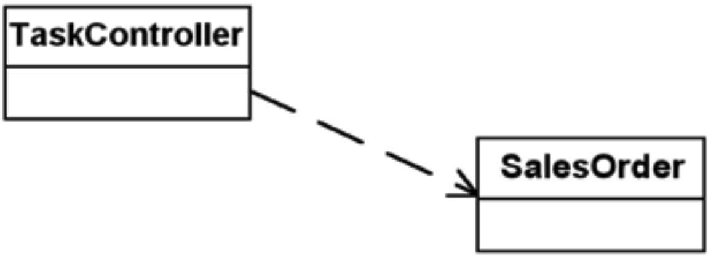

## 概念

像是選擇不同交通方式上班，
把**影響選擇的因素**(例如: 天候、預算、身體狀況、緊急程度等)和**選擇帶來的後果**(例如: 路線、耗時、花費等)拆分開來管理。


<div style="text-align: right"><sub><sup>圖片來源: https://refactoring.guru/design-patterns/strategy</sup></sub></div>

---

這篇來自讀過 *Design Patterns Explained: A New Perspective on Object Oriented Design, 2nd Edition* 一書中 *The Strategy Pattern* 章節的重點整理。

作者提出一系列面對新需求的應對方式使系統程式碼更具彈性，在面對未來的變化能更從容、更易擴充和維護。

---

## 處理新需求之案例研究

書中以一個在美國的國際電商為實務案例來說明在面對新需求的思考和處理方式。

### 訂單處理系統之系統架構



**TaskController**
- 處理銷售請求
- 決定何時將請求交給 SalesOrder 來處理訂單

**SalesOrder**
- 透過 GUI 填寫訂單
- **處理稅額計算** <-- 本章討論案例
- 列印收據

---

> 新需求：支援加拿大的稅額計算

```java
// Handle Tax
switch (myNation) {
    case US:
    // US Tax rules here break;
    case Canada:
    // Canadian Tax rules here break;
}

// Handle Currency
switch (myNation) {
    case US:
    // US Currency rules here break;
    case Canada:
    // Canadian Currency rules here break;
}

// Handle Date Format
switch (myNation) {
    case US:
    // use mm/dd/yy format break;
    case Canada:
    // use dd/mm/yy format break;
}
```

---

> 新需求：支援德國的稅額計算＆多國語系

```java
// Handle Tax
switch (myNation) {
    case US:
    // US Tax rules here break;
    case Canada:
    // Canadian Tax rules here break;
    case Germany:
    // Germany Tax rules here break;
}

// Handle Currency
switch (myNation) {
    case US:
    // US Currency rules here break;
    case Canada:
    // Canadian Currency rules here break;
    case Germany:
    // Euro Currency rules here break;
}

// Handle Date Format
switch (myNation) {
    case US:
    // use mm/dd/yy format break;
    case Canada:
    case Germany:
    // use dd/mm/yy format break;
}

// Handle Language
switch (myNation) {
    case US:
    case Canada:
    // use English break;
    case Germany:
    // use German break;
}
```

---

> 新需求：支援加拿大魁北克的法語

```java
// Handle Language
switch (myNation) {
    case Canada:
        if (inQuebec) {
            // use French break;
        }
    case US:
    // use English break;
    case Germany:
    // use German break;
}
```

---

以上作法開發中不少見，很直覺新增條件式來應付需求變化

隨著時間過去，條件式可能因為需求的堆疊而產生多種組合像棵樹一樣蔓延

這些條件全都集中在 SalesOrder 裡，程式碼會越來越難以維護

作者也把這種現象稱作 **switch creep**

---

這時熟悉物件導向特性的開發者可能會想，如果改用繼承來小幅度修改呢？

沒錯，接下來介紹透過物件導向“直接繼承”的方式來處理新需求

揭露了另一種混沌的開端

---

> 直接繼承並覆寫特定方法

<!--  -->


讓加拿大訂單和德國訂單繼承美國訂單，並 override 稅額計算方法

效果看起來還不錯，將不同國家的稅額計算規則獨立封裝起來，互不干擾

但這種類別直接繼承的擴充方式容易產生過多的類別

例如：未來要支援“免運訂單”、“員購訂單”的稅額計算，則類別數會快速增加


光是支援兩個國家的稅額計算就需要增加這麼多類別

而且別忘了 SalesOrder 除了稅額計算還有另外兩個功能，這兩個功能未來如果有其他多型分支，類別數勢必爆炸式增長！

上述這樣的現象也稱作「組合爆炸(Combinatorial explosion)」

> 組合爆炸原因是類別的責任未妥善劃分
> 1. 當每個類別擁有太多責任時
> 2. 當每個責任需要多型分支時

---

這樣的情境就很適合本篇主角 Strategy pattern 登場啦！

---

## The Strategy Pattern

> Find what varies and encapsulate it.
> 
> 找出變化並封裝之。


先將“稅額計算概念”從 SalesOrder 抽離，並抽象化成 abstract class

再將每個國家的稅額計算細節各自封裝到 concreate class (USTax, CanTax)

也就是說，未來出現稅額計算相關的需求變動，SalesOrder 不用更改程式碼，只需要新增稅額計算類別就可以完成，這也符合了 SOLID 原則中的 OCP 開放封閉原則

---

> Use aggregation instead of inheritance.
> 
> 使用聚合代替繼承。


由 TaskController 選擇**具體稅額計算物件(USTax, CanTax)**

將具體稅額計算的 **物件參照(reference)** 傳遞給 SalesOrder

SalesOrder **透過抽象稅額計算(CalcTax) 參照到具體稅額計算物件**，並執行具體稅額計算物件，而且並**不會知道**具體執行了哪個物件

---

### 定義

> Define a family of algorithms, encapsulate each one, and make them interchangeable. Strategy lets the algorithm vary independently from clients that use it. --- Gamma, et al


### 通用結構圖


## References

- https://refactoring.guru/design-patterns/strategy
- https://www.youtube.com/watch?v=IkG_KuMpQRM